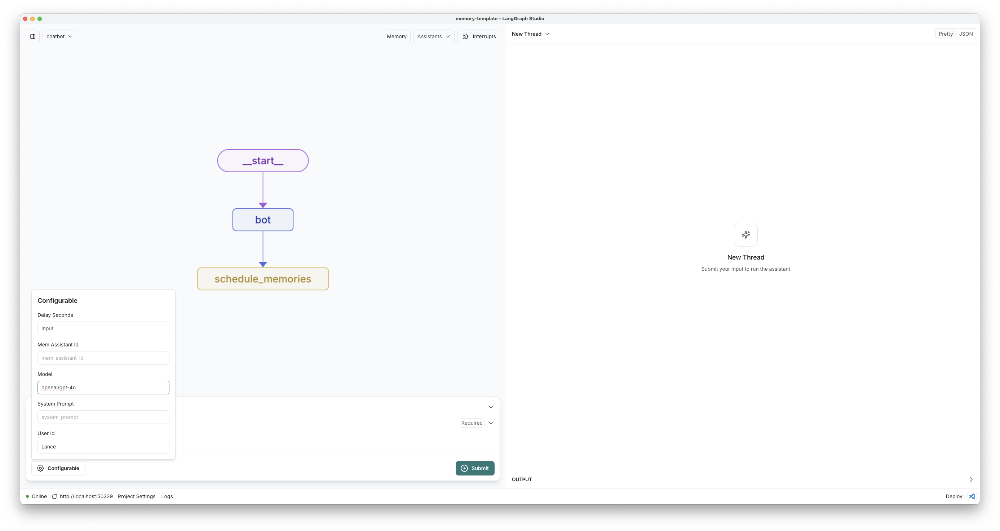
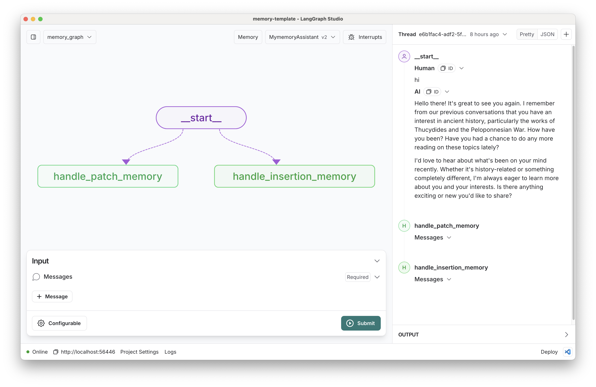

# LangGraph Memory Service

[](https://github.com/langchain-ai/memory-template/actions/workflows/unit-tests.yml)
[](https://github.com/langchain-ai/memory-template/actions/workflows/integration-tests.yml)
[![Open in - LangGraph Studio](https://img.shields.io/badge/Open_in-LangGraph_Studio-00324d.svg?logo=)](https://langgraph-studio.vercel.app/templates/open?githubUrl=https://github.com/langchain-ai/memory-template)

Memory is a powerful way to improve and personalize applications, allowing storage of information (e.g., a user-specific profile or memories) that can be used to inform responses or decisions across multiple interactions. This template provides a simple example of a long-term memory service you can build and deploy using LangGraph.

It has three main components:

(1) `Chatbot Graph`: This is a simple chatbot that interacts with a user.

(2) `Memory Graph`: This graph contains the logic for creating memories with customizable schemas from the chatbot's user interactions. 

(3) `Memory Storage`: This stores created memories, making them accessible across multiple user interactions with the chatbot.


## Getting Started

### Create .env file

1. Create a `.env` file.

```bash
cp .env.example .env
```

2. Define required API keys in your `.env` file.

<!--
Setup instruction auto-generated by `langgraph template lock`. DO NOT EDIT MANUALLY.
-->

### Setup Model

The defaults values for `model` are shown below:

```yaml
model: anthropic/claude-3-5-sonnet-20240620
```

Follow the instructions below to get set up, or pick one of the additional options.

#### Anthropic

To use Anthropic's chat models:

1. Sign up for an [Anthropic API key](https://console.anthropic.com/) if you haven't already.
2. Once you have your API key, add it to your `.env` file:

```
ANTHROPIC_API_KEY=your-api-key
```
#### OpenAI

To use OpenAI's chat models:

1. Sign up for an [OpenAI API key](https://platform.openai.com/signup).
2. Once you have your API key, add it to your `.env` file:
```
OPENAI_API_KEY=your-api-key
```

<!--
End setup instructions
-->

### Test in LangGraph Studio

If you want to test locally, [install the LangGraph Studio desktop app](https://github.com/langchain-ai/langgraph-studio?tab=readme-ov-file#download). 

If you want to test in the cloud, [follow these instructions to deploy this repository to LangGraph Cloud](https://langchain-ai.github.io/langgraph/cloud/) and open Studio in your browser. 

Open this repository in LangGraph studio. 

In LangGraph Studio, you can set your `user_id`, `model`, and other configurations.



Navigate to the "`chatbot`" graph and have a conversation with it! 

Try sending some messages saying your name and other things the bot should remember.

Wait ~10-20 seconds for many memories to be created and saved, then create a *new* thread using the `+` icon. 

Then chat with the bot again - if you've completed your setup correctly, the bot should now have access to the memories you've saved!

## How it works

### Memory Storage

The LangGraph API comes with a built-in memory storage layer that can be used to store and retrieve information across threads. 

Studio useds the LangGraph API at the backend, packaging the code in this repository with the storage layer.

In Studio, you can see the `Memories` button above your graph with any memories created and saved to the storage layer.

The storage layer is shown in the above diagram in red. 

The central points are that it: 

1. It is accessible to both the `chatbot` and the `memory_graph` in all nodes.
2. It provides an interface for storing (`put` method) and retrieving (`search` method) memories in a namespaced manner. 

Learn more about the Memory Storage layer [here](https://langchain-ai.github.io/langgraph/how-tos/memory/shared-state/).

### Chatbot Graph

The `chatbot` graph, defined in [graph.py](./src/chatbot/graph.py), has two nodes, `bot` and `schedule_memories`. 

The `chatbot` is invoked with a `user_id` supplied by configuration. 

The `bot` node uses the `user_id` to fetch any existing memories for that user from the `Memory Storage` layer.

These fetched memories are added to the system prompt of the chatbot to personalize the responses.

The `schedule_memories` node is run after the `bot` node. 

It is responsible for scheduling long-term memory creation based upon the chatbot's updated interaction with the user.

It uses the LangGraph SDK to call the `memory_graph`, suppling the chatbot's interaction with the user.

### Memory Graph

The `memory_graph` graph, defined in [graph.py](./src/memory_graph/graph.py) incoperates two different concepts: 

(1) We can define a schema for each of the types of memories we want to store. 

(2) We can update these memories in different ways using the [`trustcall` library](https://github.com/hinthornw/trustcall). 

The schema for each memory type is defined in [configuration.py](./src/memory_graph/configuration.py). 

The default schemas are `User` and `Note`. 

The `User` schema is used to store a single profile for a user, such as their name, age, and interests. 

We'll store a single JSON schema that can be updated with new information as the conversation progresses.

The `Note` schema is used to store specific events or notes about the user's interactions with the chatbot. 

We'll store a list of JSON schemas that can be updated or added to as the conversation processes.

The [`trustcall` library](https://github.com/hinthornw/trustcall) handles writing and updating either of these schemas. 


The `memory_graph` save both types of memories to the `Memory Storage` layer, namespaced by the `user_id` and the schema name.

We can see the graph here in the LangGraph Studio, with a branch for each memory schemas.



## Philosophy

### Separation of Concerns

This separation of concerns between the application logic (chatbot) and the memory processing (the memory graph) provides advantages:

(1) minimal overhead by removing memory creation logic from the hotpath of the application (e.g., no latency cost for memory creation)

(2) memory creation logic is handled in a background job, separate from the chatbot, with scheduling to avoid duplicate processing

(3) memory graph can be updated and / or hosted (as a service) independently of the application (chatbot)


### Scheduling

Scheduling is handled by the LangGraph API's `after_seconds` parameter. 

This is the intuition: we want to wait until a thread is "complete" before we write memories to the storage layer. 

We don't know when a chat will end.

So, we wait a pre-determined interval before invoking the memory graph to memories to the storage layer.

If the chatbot makes a call second time within that interval, the memory run is cancelled to avoid duplicate processing of a thread.

This cartoon highlights the concept: requests to call the `memory_graph` are delayed for some period of time. 

If any newer requests come in, the initial request is cancelled to avoid duplicate processing the same interaction. 


## How to evaluate

Memory management can be challenging to get right. To make sure your memory_types suit your applications' needs, we recommend starting from an evaluation set, adding to it over time as you find and address common errors in your service.

We have provided a few example evaluation cases in [the test file here](./tests/integration_tests/test_graph.py). As you can see, the metrics themselves don't have to be terribly complicated, especially not at the outset.

We use [LangSmith's @unit decorator](https://docs.smith.langchain.com/how_to_guides/evaluation/unit_testing#write-a-test) to sync all the evaluations to LangSmith so you can better optimize your system and identify the root cause of any issues that may arise.

## How to customize

Customize memory memory_types: This memory graph supports two different `update_modes` that dictate how memories will be managed:

1. Patch Schema: This allows updating a single, continuous memory schema with new information from the conversation. You can customize the schema for this type by defining the JSON schema when initializing the memory schema. For example:

```json
{
    "name": "User",
    "description": "Update this document to maintain up-to-date information about the user in the conversation.",
    "update_mode": "patch",
    "parameters": {
      "type": "object",
      "properties": {
        "user_name": {
          "type": "string",
          "description": "The user's preferred name"
        },
        "age": {
          "type": "integer",
          "description": "The user's age"
        },
        "interests": {
          "type": "array",
          "items": {
            "type": "string"
          },
          "description": "A list of the user's interests"
        }
      }
    }
  }
```

2. Insertion Schema: This allows inserting individual "event" memories, such as key pieces of information or summaries from the conversation. You can define custom memory_types for these event memories by providing a JSON schema when initializing the InsertionMemorySchema. For example:

```json
{
    "name": "Note",
    "description": "Save notable memories the user has shared with you for later recall.",
    "update_mode": "insert",
    "parameters": {
      "type": "object",
      "properties": {
        "context": {
          "type": "string",
          "description": "The situation or circumstance in which the memory occurred that inform when it would be useful to recall this."
        },
        "content": {
          "type": "string",
          "description": "The specific information, preference, or event being remembered."
        }
      },
      "required": ["context", "content"]
    }
  }
```

3. Select a different model: We default to anthropic/claude-3-5-sonnet-20240620. You can select a compatible chat model using provider/model-name via configuration. Example: openai/gpt-4.
4. Customize the prompts: We provide default prompts in the graph definition. You can easily update these via configuration.

For quick prototyping, these configurations can be set in the LangGraph Studio UI.

You can also quickly extend this template by:

- Adding additional nodes and edges in [graph.py](./src/memory_graph/graph.py) to modify the memory processing flow.

<!--
Configuration auto-generated by `langgraph template lock`. DO NOT EDIT MANUALLY.
{
  "config_schemas": {
    "chatbot": {
      "type": "object",
      "properties": {}
    },
    "memory_graph": {
      "type": "object",
      "properties": {
        "model": {
          "type": "string",
          "default": "anthropic/claude-3-5-sonnet-20240620",
          "description": "The name of the language model to use for the agent. Should be in the form: provider/model-name.",
          "environment": [
            {
              "value": "anthropic/claude-1.2",
              "variables": "ANTHROPIC_API_KEY"
            },
            {
              "value": "anthropic/claude-2.0",
              "variables": "ANTHROPIC_API_KEY"
            },
            {
              "value": "anthropic/claude-2.1",
              "variables": "ANTHROPIC_API_KEY"
            },
            {
              "value": "anthropic/claude-3-5-sonnet-20240620",
              "variables": "ANTHROPIC_API_KEY"
            },
            {
              "value": "anthropic/claude-3-haiku-20240307",
              "variables": "ANTHROPIC_API_KEY"
            },
            {
              "value": "anthropic/claude-3-opus-20240229",
              "variables": "ANTHROPIC_API_KEY"
            },
            {
              "value": "anthropic/claude-3-sonnet-20240229",
              "variables": "ANTHROPIC_API_KEY"
            },
            {
              "value": "anthropic/claude-instant-1.2",
              "variables": "ANTHROPIC_API_KEY"
            },
            {
              "value": "openai/gpt-3.5-turbo",
              "variables": "OPENAI_API_KEY"
            },
            {
              "value": "openai/gpt-3.5-turbo-0125",
              "variables": "OPENAI_API_KEY"
            },
            {
              "value": "openai/gpt-3.5-turbo-0301",
              "variables": "OPENAI_API_KEY"
            },
            {
              "value": "openai/gpt-3.5-turbo-0613",
              "variables": "OPENAI_API_KEY"
            },
            {
              "value": "openai/gpt-3.5-turbo-1106",
              "variables": "OPENAI_API_KEY"
            },
            {
              "value": "openai/gpt-3.5-turbo-16k",
              "variables": "OPENAI_API_KEY"
            },
            {
              "value": "openai/gpt-3.5-turbo-16k-0613",
              "variables": "OPENAI_API_KEY"
            },
            {
              "value": "openai/gpt-4",
              "variables": "OPENAI_API_KEY"
            },
            {
              "value": "openai/gpt-4-0125-preview",
              "variables": "OPENAI_API_KEY"
            },
            {
              "value": "openai/gpt-4-0314",
              "variables": "OPENAI_API_KEY"
            },
            {
              "value": "openai/gpt-4-0613",
              "variables": "OPENAI_API_KEY"
            },
            {
              "value": "openai/gpt-4-1106-preview",
              "variables": "OPENAI_API_KEY"
            },
            {
              "value": "openai/gpt-4-32k",
              "variables": "OPENAI_API_KEY"
            },
            {
              "value": "openai/gpt-4-32k-0314",
              "variables": "OPENAI_API_KEY"
            },
            {
              "value": "openai/gpt-4-32k-0613",
              "variables": "OPENAI_API_KEY"
            },
            {
              "value": "openai/gpt-4-turbo",
              "variables": "OPENAI_API_KEY"
            },
            {
              "value": "openai/gpt-4-turbo-preview",
              "variables": "OPENAI_API_KEY"
            },
            {
              "value": "openai/gpt-4-vision-preview",
              "variables": "OPENAI_API_KEY"
            },
            {
              "value": "openai/gpt-4o",
              "variables": "OPENAI_API_KEY"
            },
            {
              "value": "openai/gpt-4o-mini",
              "variables": "OPENAI_API_KEY"
            }
          ]
        }
      }
    }
  }
}
-->