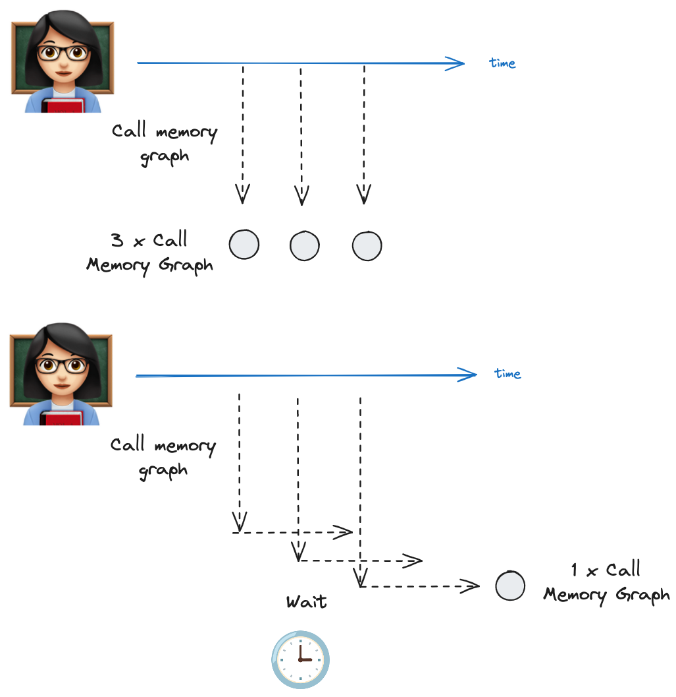
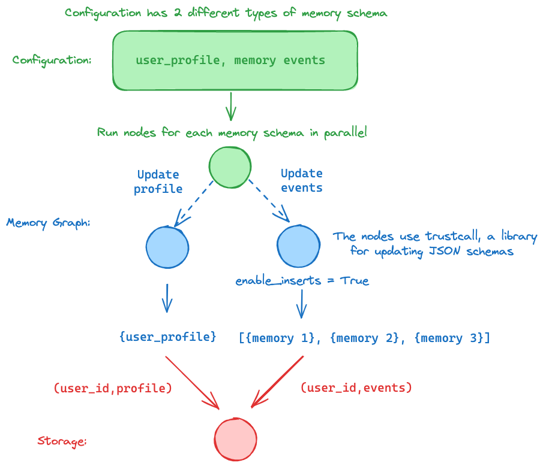

# LangGraph Memory Service

[](https://github.com/langchain-ai/memory-template/actions/workflows/unit-tests.yml)
[](https://github.com/langchain-ai/memory-template/actions/workflows/integration-tests.yml)
[![Open in - LangGraph Studio](https://img.shields.io/badge/Open_in-LangGraph_Studio-00324d.svg?logo=)](https://langgraph-studio.vercel.app/templates/open?githubUrl=https://github.com/langchain-ai/memory-template)

## Motivation

Memory is a powerful way to improve and personalize AI applications. As an example, memory can be used to store user-specific  information across multiple interactions with that user. But, it can also extend to any information that you may want to preserve across multiple interactions with an application. This template show how you can build and deploy a long-term memory service using LangGraph by combining a memory service with a simple chatbot application.


## Quickstart

Create a `.env` file.

```bash
cp .env.example .env
```

Set the required API keys in your `.env` file.

<!--
Setup instruction auto-generated by `langgraph template lock`. DO NOT EDIT MANUALLY.
-->

### Setup Model

The defaults values for `model` are shown below:

```yaml
model: anthropic/claude-3-5-sonnet-20240620
```

Follow the instructions below to get set up, or pick one of the additional options.

#### Anthropic

To use Anthropic's chat models:

1. Sign up for an [Anthropic API key](https://console.anthropic.com/) if you haven't already.
2. Once you have your API key, add it to your `.env` file:

```
ANTHROPIC_API_KEY=your-api-key
```
#### OpenAI

To use OpenAI's chat models:

1. Sign up for an [OpenAI API key](https://platform.openai.com/signup).
2. Once you have your API key, add it to your `.env` file:
```
OPENAI_API_KEY=your-api-key
```

<!--
End setup instructions
-->

If you want to test the memory service locally, [install the LangGraph Studio desktop app](https://github.com/langchain-ai/langgraph-studio?tab=readme-ov-file#download). 

If you want to test in the cloud, [follow these instructions to deploy this repository to LangGraph Cloud](https://langchain-ai.github.io/langgraph/cloud/) and use Studio in your browser. 

Open this repository in LangGraph studio and navigate to the `chatbot` graph.  

Optionally, you can set your `user_id`, `model`, or other configurations directly in the Studio UI.


Try sending some messages saying your name and other things the bot should remember.

Wait ~10-20 seconds for memories to be created and saved.

Create a *new* thread using the `+` icon. 

Then chat with the bot again. 

The bot should have access to the memories you've saved, and will use them to personalize its responses.

## How it works

There are several problems to solve when building a memory service:

1. What should each memory contain?
2. How should memories be updated?
3. How frequently should memories be updated or created?
4. Where should memories be stored?
5. How to call the memory service from our application?

We'll address these challenges below, and explain how this LangGraph template approaches them. 

### Memory Schema

The memory schema defines what each memory will contain. 

By default, this template uses two memory schemas: `User` and `Note`. Both are JSON schemas.

The schemas are defined in [memory_graph/configuration.py](./src/memory_graph/configuration.py). 

The `User` schema is used to store a single profile for a user with a set of predefined properties (e.g., name, age, interests). 

The `Note` schema is more flexible, containing a `context` and `content` field to capture any type of information as a memory. 

These schemas are customizable! You can create new schemas, or add / remove properties as needed for your application.

### Memory Updates

These memory schemas need to be updated with new information over time.

The `User` schema is a single JSON object. 

We want to update it with new information about the user as the conversation progresses.

Each `Note`, in contrast, is captured in a list. 

We want the flexibility to update existing `Note` schemas or update the list with new ones.

We use the [`trustcall` library](https://github.com/hinthornw/trustcall) to do both of these types of updates.

This is a library that we created for updating JSON schemas via a LLM.

These updates are performed in [memory_graph/graph.py](./src/memory_graph/graph.py).

The `memory_graph` saves both types of memories.

We can see the graph here in the LangGraph Studio, with a branch for each of the defined memory schemas: 

* `handle_patch_memory` is for `User` schema memories.
* `handle_insert_memory` is for `Note` schema memories.


### Memory Scheduling

Memory updates need to be scheduled to avoid duplicate processing.

Ideally, we want to wait until a chat is complete before we create memories.

But, we don't know when a chat session will end.

So, we wait a pre-determined interval before invoking the memory graph to memories to the storage layer.

If the chatbot makes a call second time within that interval, the initial memory is cancelled. 

Scheduling is handled by the LangGraph SDK's `after_seconds` parameter. 

We call the `memory_graph` from our application (e.g., `chatbot`) using the LangGraph SDK in [chatbot/graph.py](./src/chatbot/graph.py).



### Memory Storage

The LangGraph API comes with a built-in memory storage layer that can be used to store and retrieve information across threads. 

Learn more about the Memory Storage layer [here](https://langchain-ai.github.io/langgraph/how-tos/memory/shared-state/).

Importantly, the memory storage layer is namespaced by a tuple; in this case, we use the `user_id` as well as the schema name.

In addition, the memory storage layer is accessible to both the `chatbot` and the `memory_graph` in all graph nodes.

This diagram shows how these pieces fit together: 



### Calling the Memory Service

Studio uses the LangGraph API as its backend, packaging the specified code repository with the storage layer.

The `langgraph.json` file is used to configure the LangGraph API specifies the graphs to be run in Studio:

```json
    "graphs": {
        "chatbot": "./src/chatbot/graph.py:graph",
        "memory_graph": "./src/memory_graph/graph.py:graph"
    },
```

The chatbot can directly access all stored memories when it's preparing responses for the user.

You can see this in the in the `bot` node in [chatbot/graph.py](./src/chatbot/graph.py):

```python
items = await store.asearch(namespace)
```

To schedule creation of new memories, the chatbot can use the LangGraph SDK to access the memory graph.

This is done in the `schedule_memories` node in [chatbot/graph.py](./src/chatbot/graph.py)

This passes the chatbot's interaction with the user along with the scheduling parameter, `after_seconds`, to the `memory_graph`.


## Benefits

The separation of concerns between the application logic (chatbot) and the memory (the memory graph) a few advantages:

(1) minimal overhead by removing memory creation logic from the hotpath of the application (e.g., no latency cost for memory creation)

(2) memory creation logic is handled in a background job, separate from the chatbot, with scheduling to avoid duplicate processing

(3) memory graph can be updated and / or hosted (as a service) independently of the application (chatbot)

Here is a schematic of the interaction pattern:


## How to evaluate

Memory management can be challenging to get right. To make sure your memory_types suit your applications' needs, we recommend starting from an evaluation set, adding to it over time as you find and address common errors in your service.

We have provided a few example evaluation cases in [the test file here](./tests/integration_tests/test_graph.py). As you can see, the metrics themselves don't have to be terribly complicated, especially not at the outset.

We use [LangSmith's @unit decorator](https://docs.smith.langchain.com/how_to_guides/evaluation/unit_testing#write-a-test) to sync all the evaluations to LangSmith so you can better optimize your system and identify the root cause of any issues that may arise.

## How to customize

Customize memory memory_types: This memory graph supports two different `update_modes` that dictate how memories will be managed:

1. Patch Schema: This allows updating a single, continuous memory schema with new information from the conversation. You can customize the schema for this type by defining the JSON schema when initializing the memory schema. For example:

```json
{
    "name": "User",
    "description": "Update this document to maintain up-to-date information about the user in the conversation.",
    "update_mode": "patch",
    "parameters": {
      "type": "object",
      "properties": {
        "user_name": {
          "type": "string",
          "description": "The user's preferred name"
        },
        "age": {
          "type": "integer",
          "description": "The user's age"
        },
        "interests": {
          "type": "array",
          "items": {
            "type": "string"
          },
          "description": "A list of the user's interests"
        }
      }
    }
  }
```

2. Insertion Schema: This allows inserting individual "event" memories, such as key pieces of information or summaries from the conversation. You can define custom memory_types for these event memories by providing a JSON schema when initializing the InsertionMemorySchema. For example:

```json
{
    "name": "Note",
    "description": "Save notable memories the user has shared with you for later recall.",
    "update_mode": "insert",
    "parameters": {
      "type": "object",
      "properties": {
        "context": {
          "type": "string",
          "description": "The situation or circumstance in which the memory occurred that inform when it would be useful to recall this."
        },
        "content": {
          "type": "string",
          "description": "The specific information, preference, or event being remembered."
        }
      },
      "required": ["context", "content"]
    }
  }
```

3. Select a different model: We default to anthropic/claude-3-5-sonnet-20240620. You can select a compatible chat model using provider/model-name via configuration. Example: openai/gpt-4.
4. Customize the prompts: We provide default prompts in the graph definition. You can easily update these via configuration.

For quick prototyping, these configurations can be set in the LangGraph Studio UI.

You can also quickly extend this template by:

- Adding additional nodes and edges in [graph.py](./src/memory_graph/graph.py) to modify the memory processing flow.

<!--
Configuration auto-generated by `langgraph template lock`. DO NOT EDIT MANUALLY.
{
  "config_schemas": {
    "chatbot": {
      "type": "object",
      "properties": {}
    },
    "memory_graph": {
      "type": "object",
      "properties": {
        "model": {
          "type": "string",
          "default": "anthropic/claude-3-5-sonnet-20240620",
          "description": "The name of the language model to use for the agent. Should be in the form: provider/model-name.",
          "environment": [
            {
              "value": "anthropic/claude-1.2",
              "variables": "ANTHROPIC_API_KEY"
            },
            {
              "value": "anthropic/claude-2.0",
              "variables": "ANTHROPIC_API_KEY"
            },
            {
              "value": "anthropic/claude-2.1",
              "variables": "ANTHROPIC_API_KEY"
            },
            {
              "value": "anthropic/claude-3-5-sonnet-20240620",
              "variables": "ANTHROPIC_API_KEY"
            },
            {
              "value": "anthropic/claude-3-haiku-20240307",
              "variables": "ANTHROPIC_API_KEY"
            },
            {
              "value": "anthropic/claude-3-opus-20240229",
              "variables": "ANTHROPIC_API_KEY"
            },
            {
              "value": "anthropic/claude-3-sonnet-20240229",
              "variables": "ANTHROPIC_API_KEY"
            },
            {
              "value": "anthropic/claude-instant-1.2",
              "variables": "ANTHROPIC_API_KEY"
            },
            {
              "value": "openai/gpt-3.5-turbo",
              "variables": "OPENAI_API_KEY"
            },
            {
              "value": "openai/gpt-3.5-turbo-0125",
              "variables": "OPENAI_API_KEY"
            },
            {
              "value": "openai/gpt-3.5-turbo-0301",
              "variables": "OPENAI_API_KEY"
            },
            {
              "value": "openai/gpt-3.5-turbo-0613",
              "variables": "OPENAI_API_KEY"
            },
            {
              "value": "openai/gpt-3.5-turbo-1106",
              "variables": "OPENAI_API_KEY"
            },
            {
              "value": "openai/gpt-3.5-turbo-16k",
              "variables": "OPENAI_API_KEY"
            },
            {
              "value": "openai/gpt-3.5-turbo-16k-0613",
              "variables": "OPENAI_API_KEY"
            },
            {
              "value": "openai/gpt-4",
              "variables": "OPENAI_API_KEY"
            },
            {
              "value": "openai/gpt-4-0125-preview",
              "variables": "OPENAI_API_KEY"
            },
            {
              "value": "openai/gpt-4-0314",
              "variables": "OPENAI_API_KEY"
            },
            {
              "value": "openai/gpt-4-0613",
              "variables": "OPENAI_API_KEY"
            },
            {
              "value": "openai/gpt-4-1106-preview",
              "variables": "OPENAI_API_KEY"
            },
            {
              "value": "openai/gpt-4-32k",
              "variables": "OPENAI_API_KEY"
            },
            {
              "value": "openai/gpt-4-32k-0314",
              "variables": "OPENAI_API_KEY"
            },
            {
              "value": "openai/gpt-4-32k-0613",
              "variables": "OPENAI_API_KEY"
            },
            {
              "value": "openai/gpt-4-turbo",
              "variables": "OPENAI_API_KEY"
            },
            {
              "value": "openai/gpt-4-turbo-preview",
              "variables": "OPENAI_API_KEY"
            },
            {
              "value": "openai/gpt-4-vision-preview",
              "variables": "OPENAI_API_KEY"
            },
            {
              "value": "openai/gpt-4o",
              "variables": "OPENAI_API_KEY"
            },
            {
              "value": "openai/gpt-4o-mini",
              "variables": "OPENAI_API_KEY"
            }
          ]
        }
      }
    }
  }
}
-->